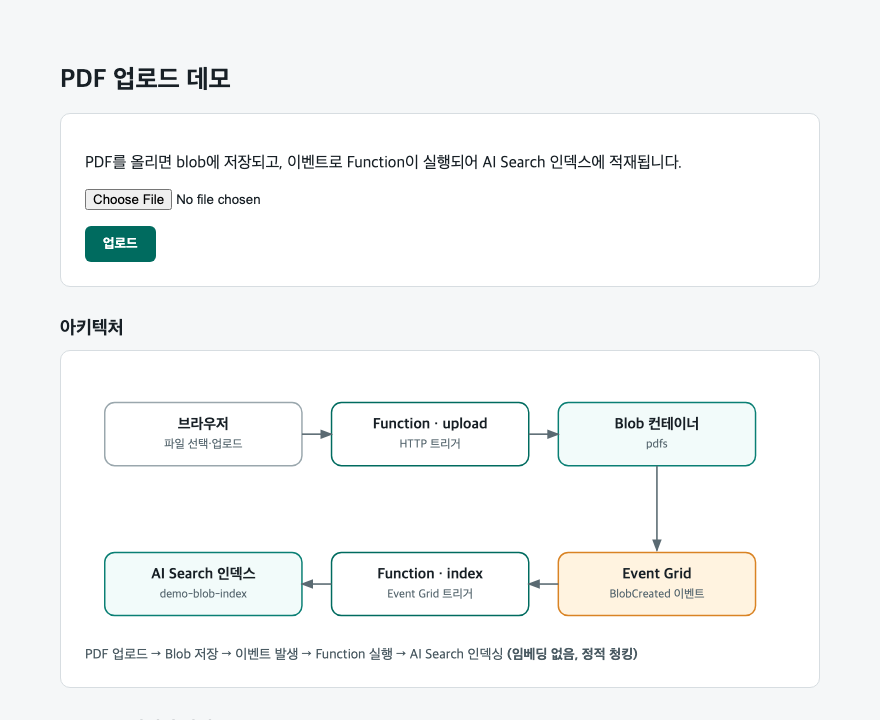
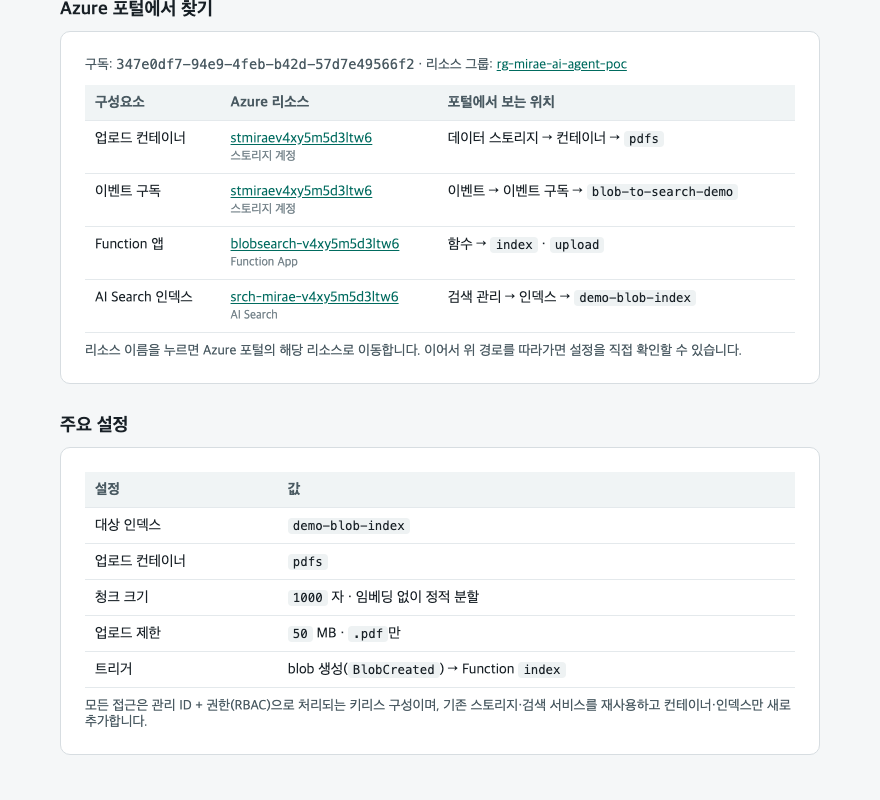
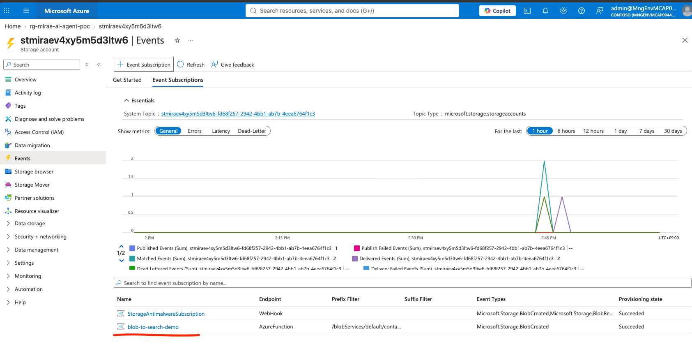
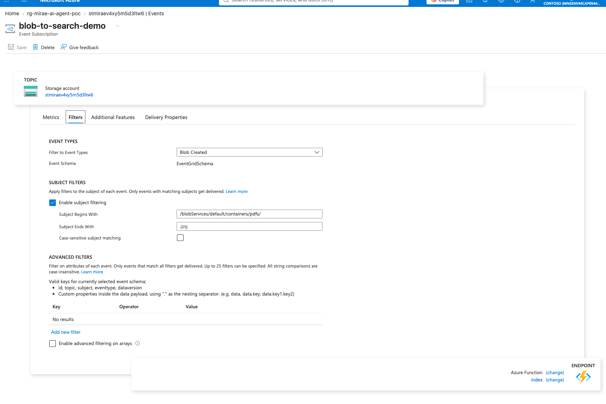
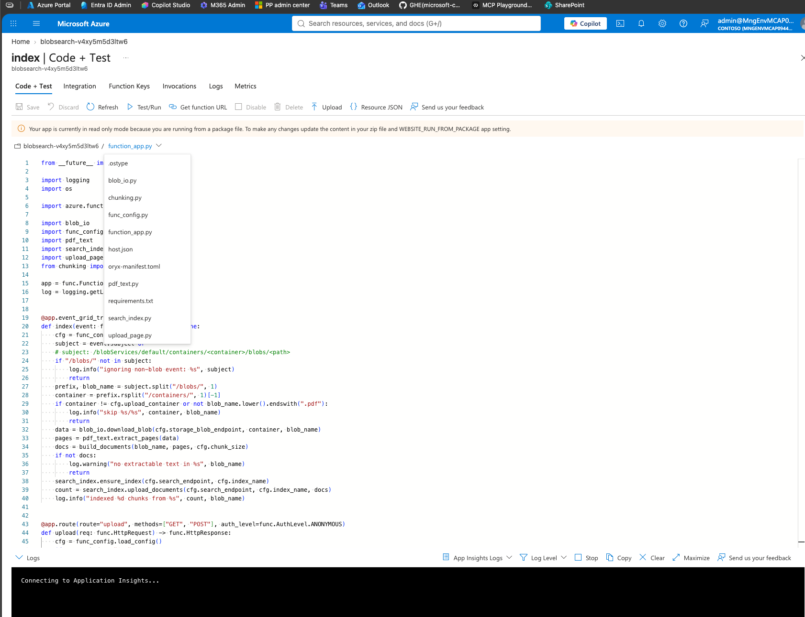
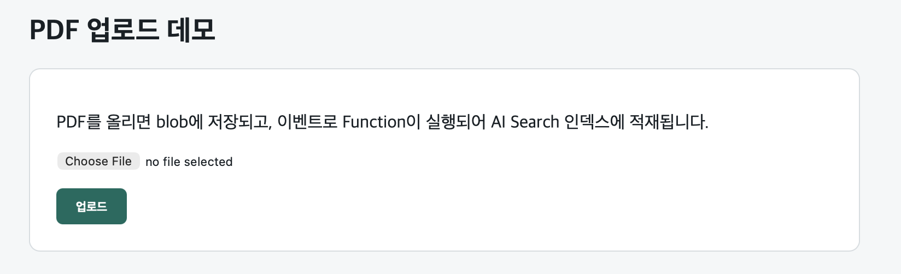
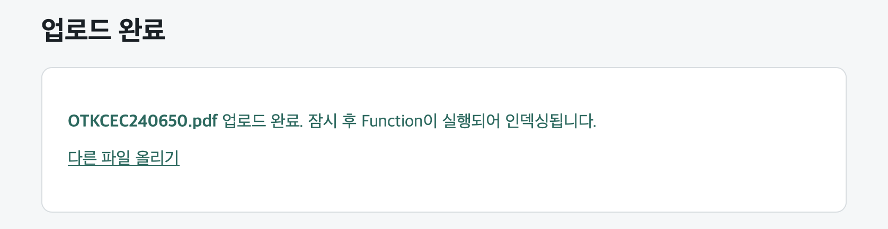
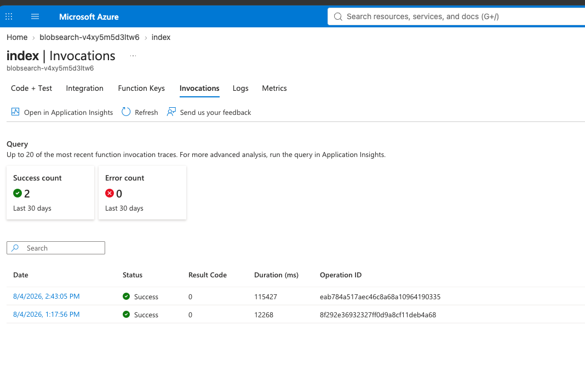
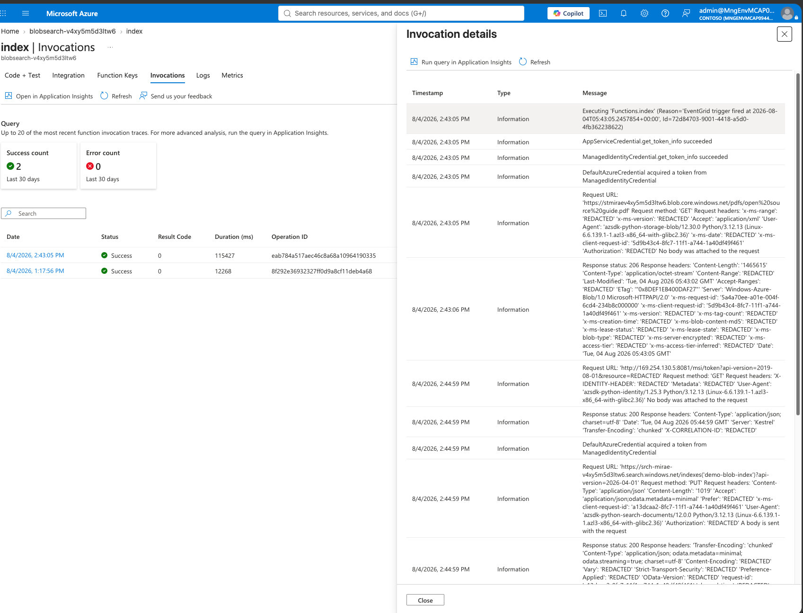
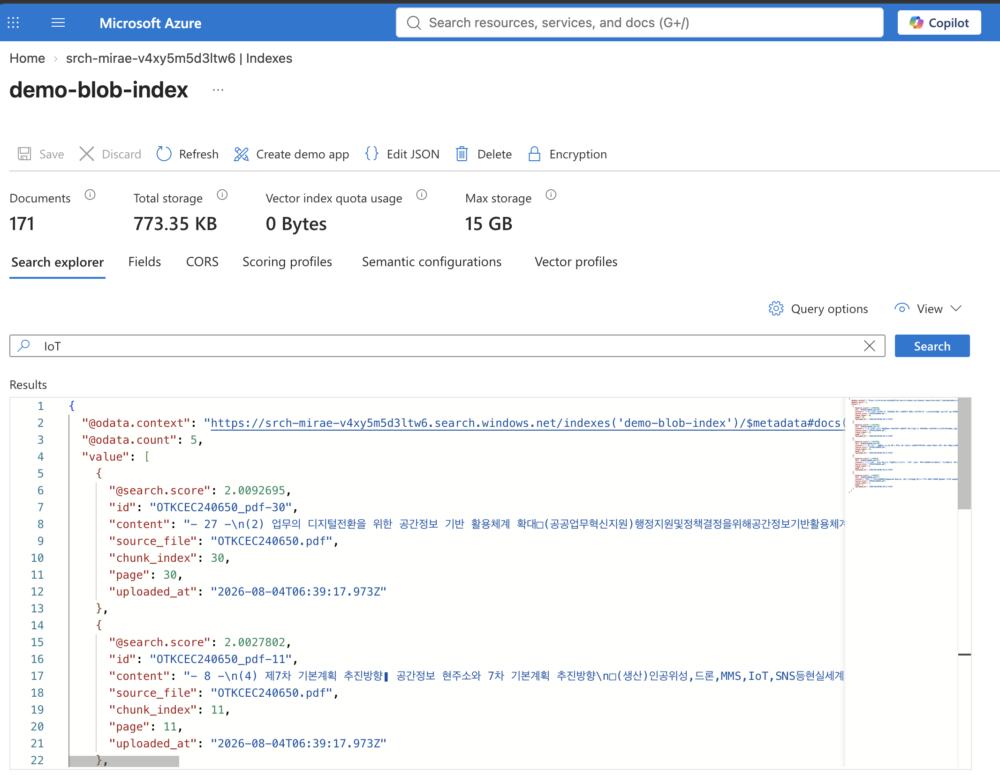

# 📄 → 🔍 PDF 업로드 자동 색인 데모 (Blob → Azure AI Search)

> Azure에 익숙하지 않은 분에게 이 데모를 **5분 안에 이해**시키기 위한 소개 문서입니다.
> (기술 상세·배포 방법은 [README.md](./README.md) 참고)

---

## 한 줄 요약

PDF를 웹에서 올리면, **아무도 버튼을 누르지 않아도** 자동으로 텍스트가 잘려서 검색 인덱스에 적재됩니다.
"파일이 올라오면 이벤트로 함수가 돌아 검색엔진에 넣는" 전형적인 **이벤트 기반 인제스트 패턴**을 최소 구성으로 시연한 것입니다.

---

## 1. 동작 흐름

```
브라우저 업로드 ─▶ Function(upload) ─▶ Blob 컨테이너(pdfs)
                                             │  "파일 생김" (BlobCreated) 이벤트
                                             ▼
   AI Search(demo-blob-index) ◀─ Function(index) ◀─ Event Grid
```

1. 웹 페이지에서 PDF를 올린다.
2. 파일이 **Blob(클라우드 파일 저장소)** 의 `pdfs` 컨테이너에 저장된다.
3. "파일이 생겼다"는 **이벤트**가 자동으로 발생한다.
4. 그 이벤트가 **Azure Function(코드)** 를 자동 호출한다.
5. 함수가 PDF에서 텍스트를 뽑아 1,000자 단위로 자른다.
6. 잘린 텍스트를 **AI Search 인덱스**에 적재한다. → 끝.

> 📸 **[캡처 첨부]** 업로드 페이지 (하단에 아키텍처 도식이 함께 표시됨)
>
> 
>
> _캡처 위치: `https://blobsearch-v4xy5m5d3ltw6.azurewebsites.net/api/upload`_

---

## 2. Azure가 낯설다면 — 용어 4개만

| 용어 | 쉽게 말하면 |
|---|---|
| **Blob Storage** | 클라우드 파일 저장소 (AWS S3 같은 것). 여기 `pdfs` 컨테이너에 PDF가 쌓입니다. |
| **Event Grid** | "파일이 올라왔다" 같은 사건을 감지해 다른 걸 자동 호출해주는 **알림 배선**. 새 서버·리소스가 아니라 스토리지에 딸린 기능입니다. |
| **Azure Function** | 서버를 직접 안 띄우고 "이 사건이 나면 이 코드 실행" 식으로 도는 **서버리스 함수** (여기선 Python). |
| **Azure AI Search** | 검색 엔진 + 색인(index). 적재된 텍스트를 키워드로 찾을 수 있습니다. |

---

## 3. 핵심 특징

- **임베딩/벡터 없음** — 텍스트를 1,000자 단위로 그냥 잘라서 넣기만 합니다. (검색 품질 고도화가 아니라 **"파이프라인이 연결되는지"** 확인이 목적)
- **키(비밀) 없음** — 계정 키·연결 문자열 대신 **관리 ID + 권한(RBAC)** 으로 접근합니다.
- **기존 리소스 재사용** — 새로 만든 건 **컨테이너 1개 + 인덱스 1개**뿐입니다.

> 📸 **[캡처 첨부]** 업로드 페이지의 "Azure 포털에서 찾기" + "주요 설정" 섹션
>
> 

---

## 4. 동작을 직접 확인하는 법

### ① 업로드해 보기
👉 <https://blobsearch-v4xy5m5d3ltw6.azurewebsites.net/api/upload>
PDF를 올리면 blob에 저장되고, 몇 초 뒤 함수가 자동 실행됩니다.

### ② Azure 포털에서 결과 보기 (적재된 데이터)
`AI Search(srch-mirae-v4xy5m5d3ltw6)` → **검색 관리 → 인덱스 → `demo-blob-index`**
→ 상단 **검색 탐색기(Search explorer)** → **Search** 클릭
→ 방금 올린 파일의 텍스트 청크(`content`, `source_file`, `page` …)가 문서로 보이면 **성공**입니다.

> 📸 **[캡처 첨부]** 검색 탐색기에서 보이는 적재 결과
>
> 

### ③ (개발자용) 인덱스 문서 수만 빠르게 확인
```bash
SEARCH_ENDPOINT=https://srch-mirae-v4xy5m5d3ltw6.search.windows.net \
  uv run python demos/blob-to-ai-search/scripts/verify_blob_demo.py
# 예) demo-blob-index 문서 수: 117
```

> 📸 **[캡처 첨부]** 검증 스크립트 출력
>
> 

### ④ (선택) 함수가 실제로 호출됐는지 로그 보기
`Function 앱(blobsearch-v4xy5m5d3ltw6)` → **함수 → `index` → 모니터(Monitor)** 또는 **로그 스트림(Log stream)**

---

## 5. 리소스 위치 (Azure 포털에서 이름으로 검색)

| 구성요소 | 리소스 이름 | 포털에서 보는 위치 |
|---|---|---|
| 리소스 그룹 | `rg-mirae-ai-agent-poc` | — |
| 업로드 페이지 / 함수 | `blobsearch-v4xy5m5d3ltw6` | 함수 → `upload` · `index` |
| 파일 저장소 | `stmiraev4xy5m5d3ltw6` | 데이터 스토리지 → 컨테이너 → `pdfs` |
| 검색 서비스 | `srch-mirae-v4xy5m5d3ltw6` | 검색 관리 → 인덱스 → `demo-blob-index` |
| 소스코드 / 문서 | 레포 `demos/blob-to-ai-search/` | `README.md` 참고 |

---

## 6. 인덱스에 뭐가 들어가나 (스키마)

| 필드 | 타입 | 설명 |
|---|---|---|
| `id` | String (key) | `<파일키>-<청크번호>` 고유 ID |
| `content` | String (searchable) | 청크 텍스트 (한국어 분석기 `ko.lucene`) |
| `source_file` | String (filterable) | 원본 파일 이름 |
| `chunk_index` | Int32 | 청크 순번 |
| `page` | Int32 | 원본 페이지 번호 |
| `uploaded_at` | DateTimeOffset | 적재 시각(UTC) |

---

> 🖼️ **이미지 첨부 방법**: 캡처한 스크린샷을 `demos/blob-to-ai-search/images/` 폴더에 위 파일명
> (`01-upload-page.png` `02-settings-detail.png` `03-search-explorer.png` `04-verify-script.png`)으로 저장하면
> 이 문서에 자동으로 렌더링됩니다.

---

## 7. 실제 Azure Portal에서 확인할 수 있는 방법.

1) Azure Blob Storage에서 Event 항목에서 트리거를 잡을 수 있음


2) 블롭 스토리지 내 특정 컨테이너에 파일이 업로드 된다면, Azure Function을 실행하라는 옵션


3) (2)항에서 트리거 발생 시 서버리스로 코드를 동작시킬 Azure Function에 업로드된 소스코드 예시


4) 웹 페이지에서 파일 업로드



5) 실제 Azure Blob Storage부터 트리거링되어서 Azure Function이 호출 된 로그


6) 성공한 로깅 확인은 다음과 같이 확인


7) 자동으로 적재된 AI Search Index 확인

