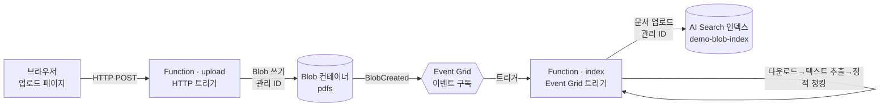

# Blob → Azure AI Search 인덱싱 데모 (이벤트 기반, 키리스)

> PDF를 Blob 컨테이너에 올리면 → **Event Grid** 이벤트가 발생하고 → **Azure Function** 이
> 실행되어 → 텍스트를 **정적으로 청킹**한 뒤 → **Azure AI Search 인덱스**에 적재합니다.
> **임베딩 없음 · 키(비밀) 없음(관리 ID + RBAC) · 기존 리소스 재사용.**

> 📌 Azure에 익숙하지 않은 분께 전달할 **쉬운 소개 문서**: [OVERVIEW.md](./OVERVIEW.md)

이 폴더는 메인 애플리케이션(Chainlit 기반 RAG 챗봇)과 **독립적인 참고용 데모**입니다.
레포를 참고하는 사람이 "블롭에 파일이 올라오면 이벤트로 함수가 돌아 검색 인덱스에 적재되는"
전형적인 이벤트 기반 인제스트 패턴을 그대로 따라 배포·확인할 수 있도록 구성했습니다.

---

## 1. 목적 (Why)

- **이벤트 기반 인제스트 패턴**을 최소 구성으로 시연: `Blob 업로드 → 이벤트 → Function → 인덱스`.
- **키리스(keyless) 운영**을 강제하는 조직 정책 환경에서도 동작하는 레퍼런스 제공
  (스토리지 `allowSharedKeyAccess=false` + `publicNetworkAccess=Disabled`, AI Search `disableLocalAuth=true`).
- **기존 인프라 재사용**: 새 리소스를 최소화하고(컨테이너 1개 + 인덱스 1개) 기존 스토리지/검색 서비스를 그대로 씀.
- 임베딩·벡터화 없이 **정적 청킹 → 인덱싱**만으로 "적재가 되는지"를 빠르게 확인하는 것이 목표
  (검색 품질 고도화가 아니라 **파이프라인 연결 확인**이 초점).

## 2. 아키텍처 / 방법 (How)



**구성요소**

| 구성요소 | 역할 | 신규/기존 |
|---|---|---|
| Blob 컨테이너 `pdfs` | 업로드된 PDF 저장소 | **신규** (기존 스토리지 계정에 컨테이너만 추가) |
| Event Grid 이벤트 구독 | `Microsoft.Storage.BlobCreated` → `index` 함수 호출 | **신규** (기존 스토리지의 Events 기능 사용, 별도 리소스 아님) |
| Function 앱 (Python v2) | `upload`(HTTP) + `index`(Event Grid) 두 트리거 | **신규** |
| AI Search 인덱스 `demo-blob-index` | 청크 텍스트 적재 대상 (런타임에 자동 생성) | **신규** (기존 검색 서비스에 인덱스만 추가) |
| 스토리지 계정 / AI Search 서비스 / App Insights | 데이터·검색·로깅 | **기존 재사용** |

**설계 포인트**

- **키리스**: 모든 데이터 평면 접근은 `DefaultAzureCredential`(함수의 관리 ID) + RBAC.
  연결 문자열/계정 키/SAS/검색 admin 키를 **일절 사용하지 않음**.
- **Dedicated(App Service B1) 플랜 사용 이유**: 스토리지가 공유키 차단 + 퍼블릭 차단이라
  Consumption/Flex 플랜의 배포 스토리지 접근이 막힘. Dedicated는 코드가 **플랫폼 관리 wwwroot**에
  배포되어 사용자 스토리지를 건드리지 않고, **런타임 스토리지 접근만** VNet 통합 + Blob 프라이빗
  엔드포인트 + 프라이빗 DNS로 처리함.
- **임베딩 없음**: `chunking.py`가 페이지 텍스트를 `CHUNK_SIZE`(기본 1000자) 단위로 정적 분할만 수행.

**인덱스 스키마** (`search_index.py`에서 정의, 벡터 필드 없음)

| 필드 | 타입 | 설명 |
|---|---|---|
| `id` | Edm.String (key) | `<파일명>-<청크번호>` 기반 고유 ID |
| `content` | Edm.String (searchable) | 청크 텍스트 |
| `source_file` | Edm.String (filterable) | 원본 blob 이름 |
| `chunk_index` | Edm.Int32 | 청크 순번 |
| `page` | Edm.Int32 | 원본 페이지 번호 |
| `uploaded_at` | Edm.DateTimeOffset | 적재 시각(UTC) |

## 3. 프로세스 (런타임 흐름)

1. 사용자가 업로드 페이지(`/api/upload`)에서 PDF를 선택해 전송한다.
2. `upload` 함수가 파일명/크기(`MAX_UPLOAD_MB`)를 검증하고, 관리 ID로 `pdfs` 컨테이너에 blob을 쓴다.
3. blob 생성으로 **Event Grid** `BlobCreated` 이벤트가 발생하고, 이벤트 구독이 `index` 함수를 호출한다.
4. `index` 함수가 이벤트의 `subject`에서 컨테이너/blob 경로를 파싱한다(대상 컨테이너 + `.pdf`만 처리).
5. 관리 ID로 blob을 내려받아 `pypdf`로 페이지별 텍스트를 추출한다.
6. `CHUNK_SIZE` 단위로 정적 청킹하여 문서 배열을 만든다(**임베딩 없음**).
7. 인덱스가 없으면 생성(`ensure_index`)한 뒤, 청크 문서를 업로드한다.
8. `verify_blob_demo.py` 또는 포털에서 `demo-blob-index` 문서 수/내용으로 적재를 확인한다.

## 4. 폴더 구조

```
demos/blob-to-ai-search/
├── README.md                     # 이 문서
├── function/                     # Azure Function 앱 (Python v2 모델)
│   ├── function_app.py           #   index(Event Grid) + upload(HTTP) 트리거
│   ├── blob_io.py                #   Blob 다운로드/업로드 (관리 ID)
│   ├── pdf_text.py               #   PDF → 페이지 텍스트 추출 (pypdf)
│   ├── chunking.py               #   정적 청킹 + 문서 빌드 (임베딩 없음)
│   ├── search_index.py           #   인덱스 생성/문서 업로드 (관리 ID)
│   ├── func_config.py            #   환경변수 기반 런타임 설정
│   ├── upload_page.py            #   업로드 웹페이지 + 아키텍처 도식 + 포털 경로
│   ├── host.json / requirements.txt / .funcignore
├── infra/                        # 데모 전용 Bicep (기존 main.bicep과 분리)
│   ├── blob-demo.bicep           #   오케스트레이터 (pdfs 컨테이너 + 함수 + 네트워크 + RBAC)
│   ├── blob-demo.bicepparam      #   기존 리소스명을 환경변수로 주입
│   └── modules/
│       ├── functionapp.bicep     #   Dedicated Linux B1 함수앱 + VNet 통합
│       ├── blobdemonet.bicep     #   VNet + Blob 프라이빗 엔드포인트 + 프라이빗 DNS
│       └── blobdemorbac.bicep    #   함수 관리 ID 역할 할당
├── scripts/
│   ├── deploy_blob_demo.sh       #   원클릭 배포 (인프라→코드→이벤트 구독)
│   └── verify_blob_demo.py       #   인덱스 문서 수 확인
└── tests/                        # 순수 파이썬 단위 테스트 (Azure 불필요)
    ├── conftest.py               #   flat 모듈 import 경로 설정
    ├── test_blob_chunking.py
    ├── test_blob_config.py
    └── test_blob_upload_page.py
```

## 5. 설정 / 배포 방법 (Setup)

### 사전 준비

- **Azure CLI** 로그인: `az login` (인프라 생성 + 역할 할당 권한 필요)
- **Azure Functions Core Tools v4**: `npm i -g azure-functions-core-tools@4`
- **uv** (검증 스크립트/테스트 실행용): <https://docs.astral.sh/uv/>
- 대상 리소스 그룹에 **기존 스토리지 계정 · AI Search 서비스 · App Insights** 존재
  (스크립트가 RG에서 자동 탐색; 여러 개면 아래 환경변수로 지정)

### 필요한 권한 · SKU (현재 배포 기준)

> 아래는 이 데모의 **실제 배포된 리소스에서 조회한 현재 설정**입니다
> (`az functionapp/plan/storage/search show` · `az role assignment list`).
> 파트너 환경도 동일한 SKU/역할이면 그대로 동작합니다.

**SKU · 보안 설정**

| 리소스 | 현재 SKU · 설정 | 이유 |
|---|---|---|
| Function 플랜 | **App Service `B1` (Basic)** · Linux · 인스턴스 1 | Consumption/Flex/EP는 공유키 기반 배포 스토리지가 필요 → 키리스·프라이빗 정책에서 불가. **Dedicated만 배포 가능** |
| Storage 계정 | **Standard_LRS** · StorageV2 · `allowSharedKeyAccess=false` · `publicNetworkAccess=Disabled` · TLS 1.2 | 키리스 강제. 함수는 VNet 통합 + Blob **프라이빗 엔드포인트**로 접근 |
| AI Search | **basic** · 파티션 1 · 복제본 1 · `disableLocalAuth=true` | admin/query 키 비활성 → **RBAC 전용**. 관리 ID로만 인덱스 생성·적재 |

**권한(RBAC) — Function의 시스템 할당 관리 ID**

배포 시 Bicep(`blobdemorbac.bicep`)이 아래 3개 역할을 자동 할당합니다(현재 배포에서 실제 할당 확인됨).

| 스코프 | 역할 | 용도 |
|---|---|---|
| Storage 계정 | **Storage Blob Data Owner** | 런타임(`AzureWebJobsStorage`)·배포·`pdfs` 컨테이너를 키 없이 read/write |
| AI Search | **Search Service Contributor** | 인덱스 생성·관리 |
| AI Search | **Search Index Data Contributor** | 인덱스에 청크 문서 업로드 |

**권한 — 배포 실행 주체(당신/파트너)**

- **Contributor**(리소스 생성) + **Owner** 또는 **User Access Administrator**(위 3개 역할을 *할당*하는 데 필요)
- `Microsoft.EventGrid` 등록 권한 — 스크립트가 `az provider register --namespace Microsoft.EventGrid` 수행

**포털에서 확인**

| 확인 대상 | 포털 위치 |
|---|---|
| 관리 ID 켜짐 | Function App → 설정 → **ID(Identity)** → 시스템 할당 = 켜짐 |
| 함수 MI 역할 | Function App → **Azure 역할 할당(Azure role assignments)** |
| 스토리지 역할 부여 | 스토리지 → **액세스 제어(IAM)** → 역할 할당 → *Storage Blob Data Owner* |
| 검색 RBAC 전용 | AI Search → **키(Keys)** → API 액세스 제어 = *역할 기반 액세스 제어* |
| 함수 플랜 SKU | Function App → **App Service 플랜** → 크기 = `B1` |

### 원클릭 배포

```bash
# 파트너 환경에 배포: 자신의 구독/리소스 그룹 지정 (미지정 시 데모 기본값 사용)
export SUB=<구독 ID>
export RG=<리소스 그룹>

# (선택) RG 안에 리소스가 여러 개면 명시적으로 지정
export UPLOAD_STORAGE_ACCOUNT=<스토리지 계정명>
export SEARCH_SERVICE_NAME=<검색 서비스명>
export APP_INSIGHTS_NAME=<App Insights명>

# 배포 (인프라 → 함수 코드 원격 빌드 → Event Grid 구독 생성까지)
demos/blob-to-ai-search/scripts/deploy_blob_demo.sh
```

스크립트가 하는 일: ① `blob-demo.bicep` 배포(pdfs 컨테이너·함수앱·VNet/PE·RBAC) →
② `func azure functionapp publish ... --build remote`로 코드 배포 →
③ 스토리지에 `BlobCreated` → `index` 함수 **Event Grid 구독** 생성.
완료 시 **업로드 페이지 URL**을 출력합니다.

> 참고: 함수 관리 ID에 부여되는 역할·SKU·배포자 권한은 위 **[필요한 권한 · SKU (현재 배포 기준)]**
> 섹션 표를 참고하세요.

### 테스트 (목표 달성 확인)

1. **웹 업로드**: 출력된 업로드 페이지(`https://<함수앱>.azurewebsites.net/api/upload`)에서 PDF 업로드.
   페이지 하단에 **아키텍처 도식** · **Azure 포털에서 찾는 경로** · **주요 설정**(대상 인덱스,
   업로드 컨테이너, 청크 크기, 트리거)이 실시간 값으로 함께 표시됩니다.
2. **(대안) CLI 업로드**:
   ```bash
   az storage blob upload --account-name <스토리지> --container pdfs \
     --auth-mode login -f <sample.pdf> -n <sample.pdf>
   ```
3. **인덱스 적재 확인**:
   ```bash
   SEARCH_ENDPOINT=https://<검색 서비스>.search.windows.net \
     uv run python demos/blob-to-ai-search/scripts/verify_blob_demo.py
   # 예) demo-blob-index 문서 수: 24
   ```

### 단위 테스트 (Azure 불필요, 순수 파이썬)

```bash
uv run pytest demos/blob-to-ai-search/tests -q
```

### 런타임 설정값 (함수앱 App Settings)

| 키 | 기본값 | 설명 |
|---|---|---|
| `SEARCH_ENDPOINT` | — | AI Search 엔드포인트 |
| `SEARCH_INDEX_NAME` | `demo-blob-index` | 대상 인덱스명 |
| `STORAGE_BLOB_ENDPOINT` | — | Blob 서비스 엔드포인트 |
| `UPLOAD_CONTAINER` | `pdfs` | 업로드 컨테이너명 |
| `CHUNK_SIZE` | `1000` | 청크 크기(문자 수) |
| `MAX_UPLOAD_MB` | `50` | 업로드 최대 크기 |
| `AzureWebJobsStorage__blobServiceUri` / `__credential=managedidentity` | — | 키리스 호스트 스토리지 |

## 6. Azure 포털에서 찾기

Azure에 익숙하지 않아도 포털에서 각 설정을 직접 확인할 수 있도록, 리소스별 위치를 정리했습니다.
(업로드 웹페이지에도 동일한 표가 실시간 값으로 렌더링됩니다.)

| 구성요소 | Azure 리소스 | 포털에서 보는 위치 |
|---|---|---|
| 업로드 컨테이너 | 스토리지 계정 | 데이터 스토리지 → 컨테이너 → `pdfs` |
| 이벤트 구독 | 스토리지 계정 | 이벤트 → 이벤트 구독 → `blob-to-search-demo` |
| Function 앱 | Function App | 함수 → `index` · `upload` |
| AI Search 인덱스 | AI Search | 검색 관리 → 인덱스 → `demo-blob-index` |

## 7. 정리 (삭제)

```bash
# Event Grid 구독 삭제
STORAGE_ID=$(az storage account show -g <RG> -n <스토리지> --query id -o tsv)
az eventgrid event-subscription delete --name blob-to-search-demo --source-resource-id "$STORAGE_ID"

# 함수앱 + 플랜 + VNet/PE 삭제 (이름은 배포 출력/포털에서 확인)
az functionapp delete -g <RG> -n <함수앱명>
az appservice plan delete -g <RG> -n <함수앱명>-plan --yes

# 데모 컨테이너/인덱스 정리
az storage container delete --account-name <스토리지> --name pdfs --auth-mode login
#  demo-blob-index 인덱스는 검색 서비스 → 인덱스에서 삭제
```

> 기존 스토리지 계정·AI Search 서비스·App Insights는 **공유 리소스**이므로 삭제하지 마세요.

## 8. 제약 / 참고

- 이 데모는 **파이프라인 연결 확인**이 목적이라, 검색 품질(임베딩/시맨틱/재랭킹)은 다루지 않습니다.
- `subscription id`·리소스 그룹명은 데모 기본값이 배포 스크립트에 들어 있습니다(비밀 아님). 다른 환경에서
  쓰려면 `SUB=<구독> RG=<리소스그룹>` 환경변수로 넘기면 됩니다(스크립트 수정 불필요).
- 메인 애플리케이션 코드/인프라(`infra/main.bicep` 등)와 **소스코드 결합이 없습니다**. 같은 레포에
  공존하며 일부 Azure 리소스(스토리지/검색/App Insights)만 격리된 방식으로 공유합니다.
